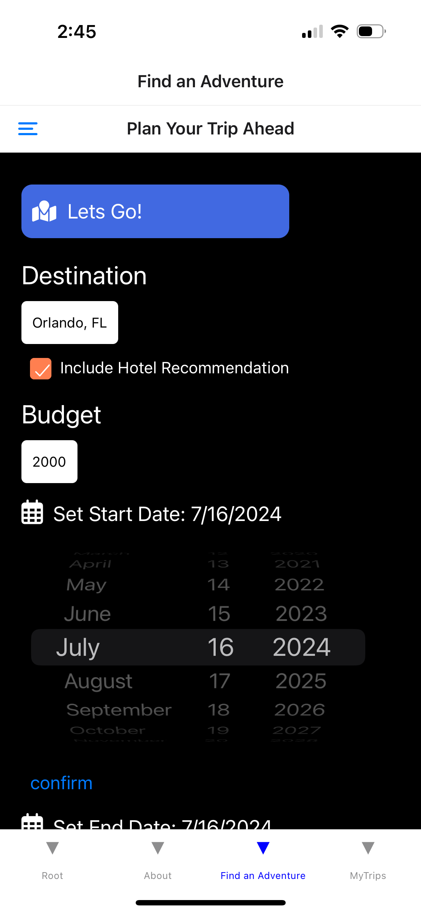
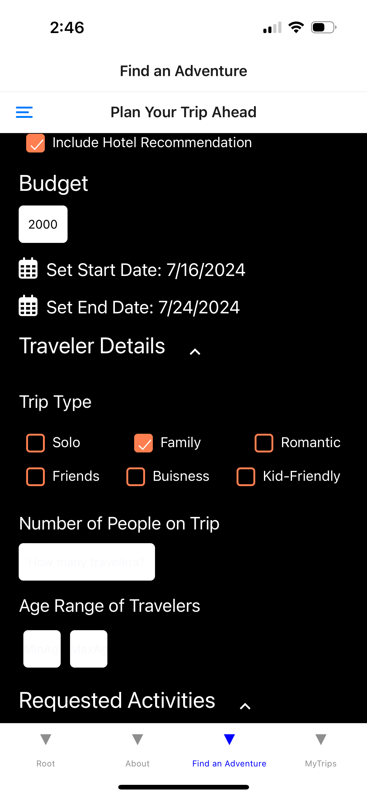
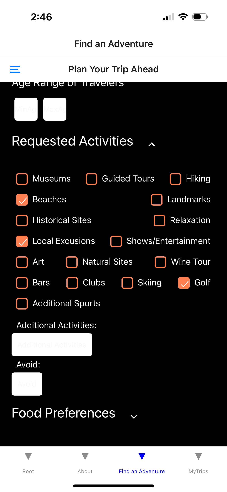
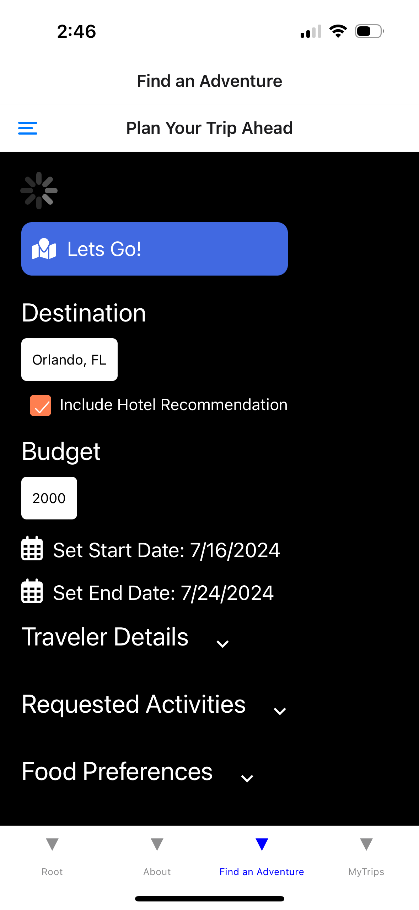
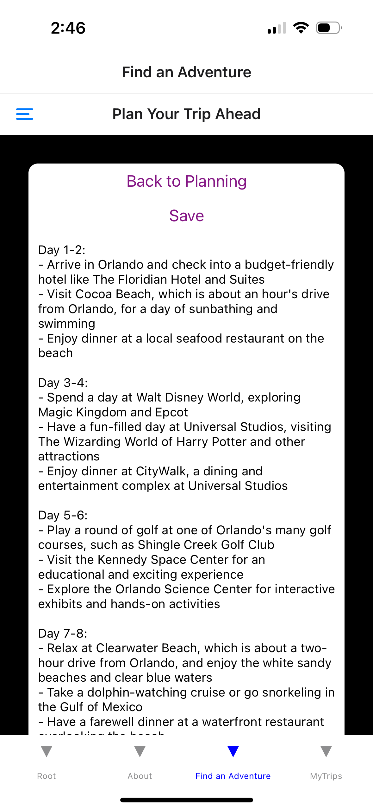
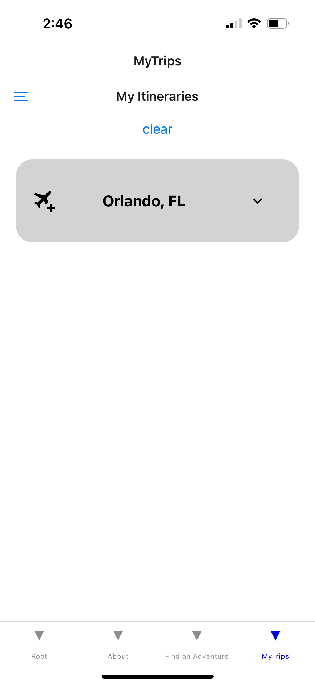
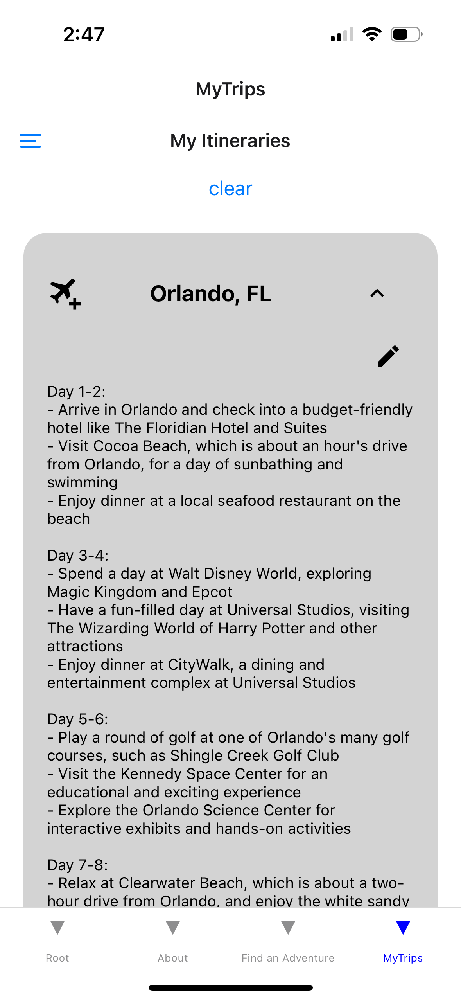
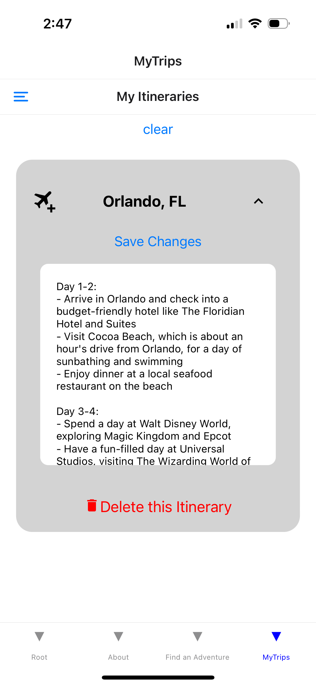
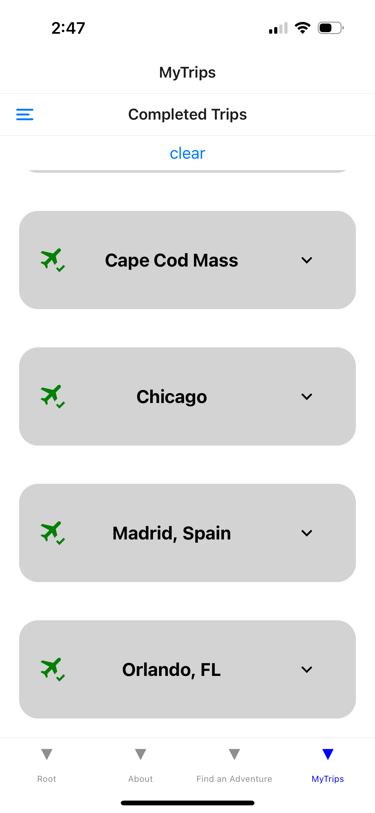
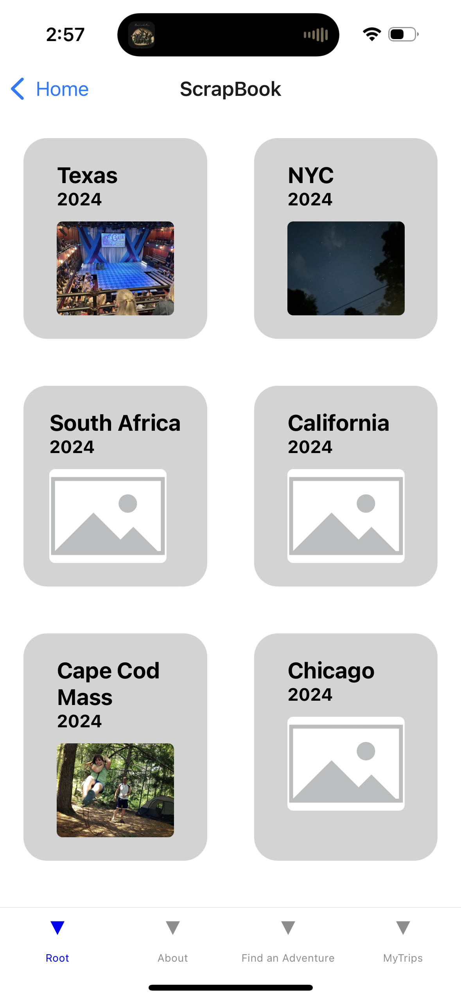

# adventure-advisor

## Uses
AdventureAdvisor is here to solve all of your travel headaches through planning your trip, and allowing easy documentation so that you will never forget about it. This tool will generate a detailed itinerary for any location based on user specifications. The user will then have the option to save this itinerary, edit as desired, and add photos in the 'scrabook' section of the app. 

## Tools
This app was built using react-native, javascript. Data is stored locally on the device using async storage. AdventureAdvisor also uses tools from expo such as image picker, vector icons, location, and in current development is a camera using cameraView. Persistantly stored variables are the username, trips, and completed (trips). Trips stores an array of objects. The objects include the following fields: the 'prompt' sent to ChatGPT, 'plan' which is the itinerary, 'startDate', and 'endDate'. Once a 'trip' is moved to completed, it adds a field for photos. These values are shared accross the app using value context. 

## How to Start
First, there is no config.js present in this repository. Once pulled to your device, you will need to add 'config.js' to the components folder, and export a constant of your personal ChatGPT API key as variable "CHAT_GPT_API_KEY".

Next, open a terminal and navigate to the project. Run - npx expo start, and scan the QR code using a mobile device. You must have the expoGo app already installed on your phone. Alternatively, it should work currently on a computer by editing components/Storage.js to comment out the "storageBackend: AsyncStorage" line and uncomment the "storageBackend: window.localStorage" line. If you wish to open it on the computer after completing this additional step, press w in the terminal. 

## A Tour of My Work

Welcome to AdventureAdvisor! Your personal trip planning and documentation assistant!

 

 

Let's first check out planning. Navigate to this tool with the tab navigator at the bottom of the screen, pressing "Find an Adventure". Enter your destination, dates of travel, start and end date, and additional parameters and specifications. All of these are optional aside from destination, if no dates are entered, the app will assume that the trip is only one day and plan accordinly. The variables here are "useState" variables in react and are set and unset as soon as buttons are clicked. 

 

  

 

Once the user presses "Lets Go!" the program puts all of the parameters collected through the check boxes, datepickers, and text boxes into a sentence. That sentence is then sent as a query to ChatGPT. Once the response is shown to the user, they can chose to save the itinerary or continue working. Let's imagine that they save this trip.

  

 
 
To view saved itineraries, one again use the bottom tabs to navigate to "MyTrips". Here are itineraries of trips that the user has not left for yet. They can see them listed here, and edit as necessary, or delete the itinerary. These are stored persistantly. 
  

Using the drawr navigator on the top left, the user can view and edit their "completed trips" meaning they have already departed for them. The same features here exist for editing and deleting. The only difference is that this flatlist displays the elements of completed:[] rather than trips:[]. 

The difference between 'trips' and 'completed' can be seen in the scrabook section. The user can navigate here by returning to the home page and clicking the 'Scrapbook' button. On the left is the home page with all 'completed' trips. If the user clicks on the image, it takes them to a 'TripDetails' page, that displays completed trip details (seen right). 
 

